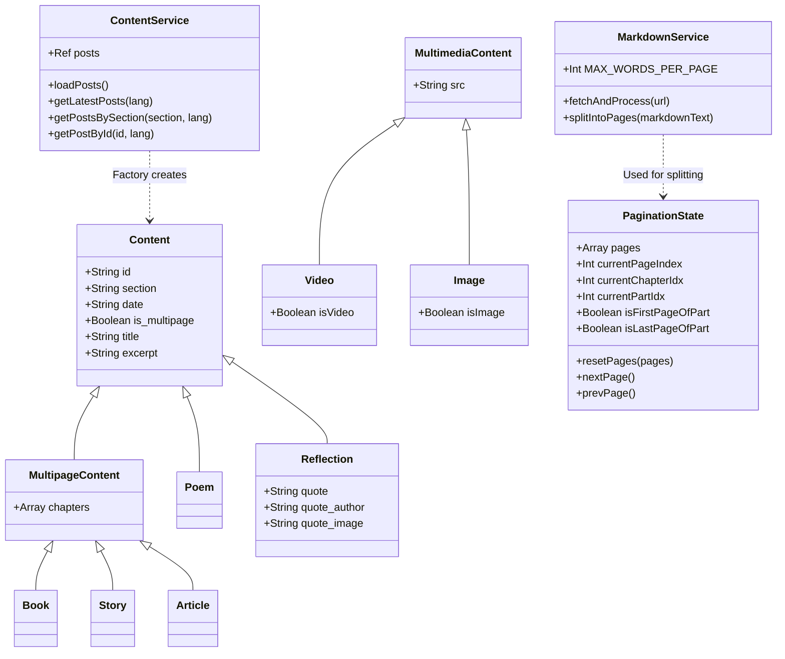

# Sitio Web Oficial de Álvaro Maleno

Este repositorio contiene el código fuente y el contenido del sitio web oficial de Álvaro Maleno.

## 1. Cómo iniciar el proyecto

Este proyecto es una Single Page Application (SPA) moderna construida **sin herramientas de compilación** (sin Node.js, Webpack, Vite ni dependencias de npm). Depende completamente de características nativas del navegador como los ES Modules (`<script type="module">`).

Para ejecutar la aplicación localmente, solo necesitas servir el directorio con un servidor de archivos estáticos.

**Usando Python:**
```bash
# Desde la raíz del proyecto
python3 -m http.server 8000
```
Luego navega a `http://localhost:8000` en tu navegador web.

**Usando VSCode:**
Si usas Visual Studio Code, puedes instalar la extensión "Live Server". Simplemente haz clic derecho en `index.html` y selecciona "Open with Live Server".

## 2. Guía de Mantenimiento

El contenido del sitio está completamente desacoplado de la lógica de la aplicación. Utiliza archivos Markdown (`.md`) para el texto en sí y un archivo JSON central para el índice.

### Cómo añadir nuevo contenido
1. **Crea los archivos Markdown**: Coloca tu nuevo contenido dentro de la carpeta `content/`, estructurado por sección e id. Por ejemplo, `content/articulos/mi-nuevo-articulo.es.md` y `content/articulos/mi-nuevo-articulo.en.md` para soporte bilingüe.
2. **Registra el contenido en el Índice**: Abre `content/index.json` y añade una nueva entrada al array JSON. Esto es lo que la aplicación lee para listar las publicaciones disponibles.

**Ejemplo de una entrada en `index.json`:**
```json
{
  "id": "mi-nuevo-articulo",
  "section": "articulos",
  "date": "2026-05-24",
  "is_multipage": false,
  "es": {
    "title": "Mi Nuevo Artículo",
    "excerpt": "Un breve resumen del artículo para mostrar en la lista."
  },
  "en": {
    "title": "My New Article",
    "excerpt": "A short summary of the article to display in the list."
  }
}
```

## 3. Tecnologías Usadas

- **Vue 3 (vía CDN)**: El framework reactivo principal de la interfaz de usuario. En lugar de compilar archivos `.vue`, este proyecto utiliza archivos JavaScript puros que exportan objetos de configuración de Vue, aprovechando la reactividad nativa del navegador.
- **Vue Router (vía CDN)**: Maneja el enrutamiento del lado del cliente para navegar entre secciones sin recargar la página.
- **ES Modules Nativos**: Se usan las declaraciones nativas `import` y `export` del navegador para estructurar el código, evitando la necesidad de un empaquetador (bundler).
- **CSS Vanilla**: Todos los estilos se realizan mediante CSS puro (`styles.css`), manteniendo el proyecto ligero.
- **Markdown / marked.js**: Se utiliza para obtener, analizar y renderizar los archivos de texto de forma segura en HTML.

## 4. Resumen de la Arquitectura

*(Dirigido a Ingenieros de Software/Backend no familiarizados con Frontend)*

Este proyecto implementa una estricta **Arquitectura en Capas** (similar a MVC o Arquitectura Limpia), adaptada para una SPA de frontend. Debido a que no hay paso de compilación ni entorno node, todo está estructurado usando JavaScript puro.

### Capas:
1. **Modelos (Capa de Dominio)**: Ubicados en `src/models/`. Son clases puras de JavaScript (`Content`, `Multimedia`, `PaginationState`). Encapsulan las entidades de negocio, el estado y la lógica de dominio de forma completamente independiente del framework de la UI. Hacen uso de herencia y fábricas (factories).
2. **Servicios (Capa de Aplicación/Infraestructura)**: Ubicados en `src/services/`. Clases como `ContentService` y `MarkdownService` actúan como singletons. Manejan la entrada/salida externa (obteniendo el índice JSON y los archivos Markdown), aplican lógicas complejas (como la división y paginación del texto) e instancian los Modelos de Dominio. Los servicios se proveen globalmente a la aplicación mediante Inyección de Dependencias.
3. **Vistas y Componentes (Capa de Presentación)**: Ubicados en `src/views/` y `src/components/`. Vue 3 orquesta esta capa. Las Vistas inyectan los Servicios necesarios para obtener los Modelos, y automáticamente renderizan la interfaz de usuario de forma reactiva basándose en el estado de dichos Modelos.
4. **Router**: Ubicado en `src/router/`. Mapea las rutas URL a Vistas específicas.

Esta separación de responsabilidades asegura que la aplicación sea altamente testeable, mantenible y que la lógica de negocio esté completamente aislada del renderizado de la UI.

## 5. Diagramas de Clases

A continuación se muestra el diagrama de clases con los modelos de dominio y servicios principales, utilizando sintaxis Mermaid.


