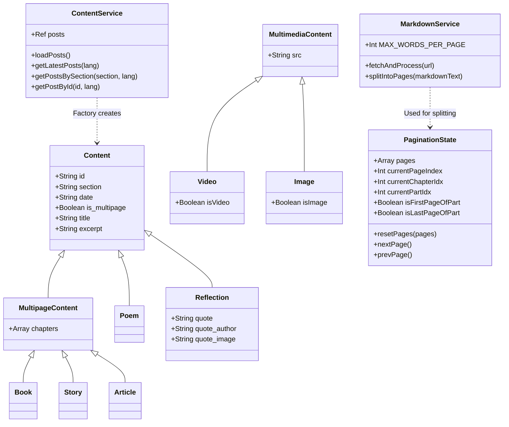

# Alvaro Maleno Official Website

This repository contains the source code and content for the official website of Álvaro Maleno.

## 1. Getting Started

This project is a modern Single Page Application (SPA) built **without any build tools** (no Node.js, Webpack, Vite, or npm dependencies). It relies entirely on native browser features such as ES Modules (`<script type="module">`).

To run the application locally, you only need to serve the directory with a static file server.

**Using Python:**
```bash
# From the root of the project
python3 -m http.server 8000
```
Then navigate to `http://localhost:8000` in your web browser.

**Using VSCode:**
If you use Visual Studio Code, you can install the "Live Server" extension. Just right-click on `index.html` and select "Open with Live Server".

## 2. Maintenance Guide

The site's content is completely decoupled from the application logic. It uses Markdown (`.md`) files for the actual text, but heavy metadata is distributed across individual folders.

### How to add new content
1. **Create the Folder Structure**: Each post (story, poem, article, book) must have its own subfolder within the corresponding section (e.g., `content/poemas/my-new-poem/`).
2. **Create the Metadata file (`meta.json`)**: Inside that new folder, create a `meta.json` file. This file will contain structural information (like chapter configs if multipage).
3. **Create the Markdown files**: Place your new text content inside the folder, structured by language (e.g., `my-new-poem.es.md` and `my-new-poem.en.md`).
4. **Register the content in the General Index**: Open `content/index.json` and add a lightweight summary of your post. The application reads this index to list and sort content, and only loads the full `meta.json` asynchronously when the user clicks to read it.

**Example of a lightweight entry in `index.json`:**
```json
{
  "id": "my-new-poem",
  "section": "poemas",
  "date": "2026-05-24",
  "en": {
    "title": "My New Poem",
    "excerpt": "A short summary..."
  },
  "es": {
    "title": "Mi Nuevo Poema",
    "excerpt": "Un breve resumen..."
  },
  "meta_path": "./content/poemas/my-new-poem/meta.json"
}
```

### Articles and Series
Articles support grouping by **Series**. To add an article to a thematic series, place it in an additional subfolder: `content/articulos/[series-name]/[my-article]/`. Also, make sure to add `"series": "series-name"` to the `index.json` entry.

## 3. Technologies Used

- **Vue 3 (via CDN)**: The core reactive UI framework. Instead of compiling `.vue` Single-File Components, this project uses plain JavaScript files that export Vue options objects, utilizing native browser reactivity.
- **Vue Router (via CDN)**: Handles Client-Side Routing to navigate between sections without reloading the page.
- **Native ES Modules**: The browser's native `import` and `export` statements are used to structure the code, avoiding the need for a bundler.
- **Vanilla CSS**: All styling is done through plain CSS (`styles.css`), keeping the project lightweight.
- **Markdown / marked.js**: Used to fetch, parse, and render the text files securely into HTML.

## 4. Architecture Overview

*(Intended for Software/Backend Engineers unfamiliar with Frontend)*

This project implements a strict **Layered Architecture** (similar to MVC or Clean Architecture), adapted for a frontend SPA. Because there is no build step or node environment, everything is structured using pure JavaScript.

### Layers:
1. **Models (Domain Layer)**: Located in `src/models/`. These are pure JavaScript classes (`Content`, `Multimedia`, `PaginationState`). They encapsulate business entities, state, and domain logic completely independent of the UI framework. They make use of inheritance and factories.
2. **Services (Application/Infrastructure Layer)**: Located in `src/services/`. Classes like `ContentService` and `MarkdownService` act as singletons. They handle external I/O (fetching JSON indexes and Markdown files), apply complex logic (like text pagination splitting), and instantiate Domain Models. Services are provided globally to the application via Dependency Injection.
3. **Views & Components (Presentation Layer)**: Located in `src/views/` and `src/components/`. Vue 3 orchestrates this layer. Views inject the necessary Services to fetch Models, and automatically render the UI reactively based on the Models' state.
4. **Router**: Located in `src/router/`. Maps URL paths to specific Views.

This separation of concerns ensures that the application is highly testable, maintainable, and that business logic is completely isolated from UI rendering.

## 5. Class Diagrams

Below is the class diagram showing the core domain models and services, utilizing Mermaid syntax.


